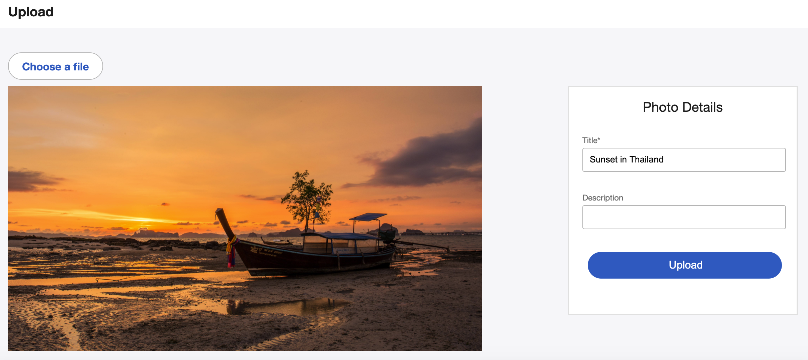

# beyondPixels
[beyondPixels](https://beyondpixels.herokuapp.com/), a 500px clone, is an application that allows amateur and professional photographers to share their world through their own lenses.

## Features
* Users can sign up, log in, log out or just simply use the demo login option
* Users can upload their favorite photos to share them with other users
* Users can edit or delete their photos
* Clean and modern Photo Grid
* Simple and user-friendly design

## Technologies
* Ruby on Rails
* React / Redux
* PostgreSQL
* Heroku
* Amazon S3

## Features under development
* Follows
    - Logged in users can follow and unfollow other users
* Profile Page
    - Surface where users can see all the photos and information from a specific user
* Home Feed
    - Surface where logged in users can see the newest photos from their followed users
* Photo Upload / Edit
    - Errors in case of unsuccessful upload or edit
    - Successful upload/edit message
    - Redirecting to photo show page
* Photo Show Page
    - User information
    - Edit button
    
## Upcoming features:
* Discover
    - Surface for all the photos of the site
    - Non-registered users can also see the photos
* Likes
    - Users can like photos
* Comments
    - Users can comment photos
* Tags
    - Users can add tags to photos
* Notifications
    - Users get notified of likes, follows, comments... 
